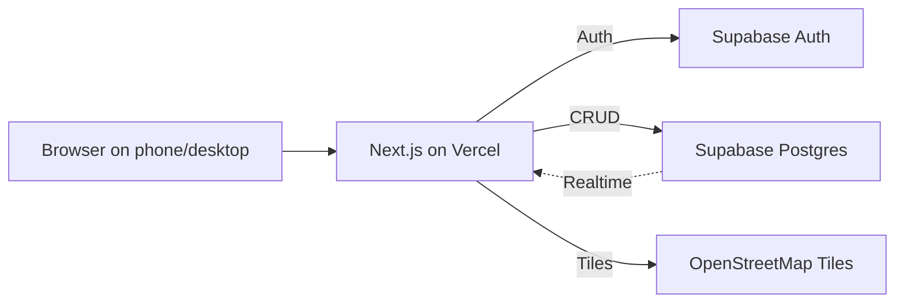

# Third-Space Discovery App — V1 Build Plan

## Locked Decisions

- **Frontend + Backend**: Next.js 15 (App Router) + TypeScript
- **UI**: Tailwind CSS + `shadcn/ui` (for forms, buttons, dialogs)
- **Database / Auth / Realtime**: Supabase (free tier)
- **Maps**: Leaflet + OpenStreetMap via `react-leaflet` (no API key, no billing)
- **Hosting**: Vercel (auto-deploy from GitHub)
- **Total cost**: ₹0

## V1 Scope (and ONLY this)

1. Google login (via Supabase Auth)
2. Post an activity (title, location pin, time, max people, category)
3. Map view with live pins of active activities
4. Join button + live participant count via Supabase Realtime

Everything else (friends, profiles, chat, social feed, tags, reviews, filters, matching engine) is **explicitly V2**. Do not let scope creep.

---

## Architecture at a Glance



One repo, one deploy, three external services (Supabase, Vercel, OSM tiles — all free).

---

## Data Model (Supabase / Postgres)

Three tables. That's it.

```sql
create table profiles (
  id uuid primary key references auth.users on delete cascade,
  display_name text,
  avatar_url text,
  created_at timestamptz default now()
);

create table activities (
  id uuid primary key default gen_random_uuid(),
  host_id uuid not null references profiles(id) on delete cascade,
  title text not null,
  description text,
  category text not null,           -- sport | study | food | hobby | other
  lat double precision not null,
  lng double precision not null,
  location_name text,               -- free text like "Indiranagar 1st Stage Park"
  start_time timestamptz not null,
  max_participants int not null check (max_participants between 2 and 50),
  created_at timestamptz default now()
);

create index on activities (start_time);
create index on activities (lat, lng);

create table participants (
  activity_id uuid references activities(id) on delete cascade,
  user_id uuid references profiles(id) on delete cascade,
  joined_at timestamptz default now(),
  primary key (activity_id, user_id)   -- prevents duplicate joins
);
```

**RLS policies** (enable on all three):

- `profiles`: anyone authenticated can `select`; only owner can `update`.
- `activities`: anyone authenticated can `select`; only authenticated can `insert` (with `host_id = auth.uid()`); only host can `update`/`delete`.
- `participants`: anyone authenticated can `select`; only authenticated can `insert` (with `user_id = auth.uid()`); only the row's user can `delete`.

**Atomic join (avoid race conditions on `max_participants`)** — Postgres function:

```sql
create or replace function join_activity(p_activity uuid)
returns text language plpgsql security definer as $$
declare
  v_max int;
  v_count int;
begin
  select max_participants into v_max from activities where id = p_activity for update;
  if v_max is null then return 'not_found'; end if;
  select count(*) into v_count from participants where activity_id = p_activity;
  if v_count >= v_max then return 'full'; end if;
  insert into participants(activity_id, user_id) values (p_activity, auth.uid())
    on conflict do nothing;
  return 'ok';
end;
$$;
```

Call it from the client: `supabase.rpc('join_activity', { p_activity: id })`.

---

## Folder Structure

```
src/
  app/
    layout.tsx                    // Supabase provider, Toaster
    page.tsx                      // Landing -> redirects to /map if logged in
    login/page.tsx                // "Sign in with Google" button
    map/page.tsx                  // Main screen: map + list
    post/page.tsx                 // Create activity form
    activity/[id]/page.tsx        // Detail + Join button
    auth/callback/route.ts        // Supabase OAuth callback
  components/
    Map.tsx                       // dynamic-imported Leaflet (no SSR)
    ActivityPin.tsx
    ActivityCard.tsx
    PostForm.tsx
    LocationPicker.tsx            // click on map to drop a pin
  lib/
    supabase/client.ts            // browser client
    supabase/server.ts            // server client (cookies)
    types.ts                      // Activity, Participant types
  middleware.ts                   // protect /map, /post, /activity/*
```

**Critical Leaflet detail**: import `Map.tsx` via `next/dynamic` with `ssr: false`. Leaflet touches `window` and will crash SSR otherwise.

---

## Day-by-Day Build (5-7 days)

### Day 1 — Setup & Auth

- `npx create-next-app@latest` (TS, Tailwind, App Router)
- `npx shadcn@latest init` then add: `button`, `input`, `dialog`, `select`, `sonner`
- Install: `@supabase/supabase-js @supabase/ssr leaflet react-leaflet date-fns zod react-hook-form`
- Create Supabase project, paste keys into `.env.local`
- Enable Google provider in Supabase Auth, paste redirect URL
- Wire `/login`, `/auth/callback`, and `middleware.ts` for protected routes
- **Done when**: a user can sign in with Google and land on `/map`.

### Day 2 — Database & Post Activity

- Run the SQL above in Supabase SQL editor (tables, RLS, `join_activity` function)
- Build `/post` page with `react-hook-form` + `zod` validation
- `LocationPicker.tsx`: small Leaflet map; click to drop pin → sets `lat/lng`
- Submit → `supabase.from('activities').insert(...)`
- **Done when**: an activity appears in the Supabase table.

### Day 3 — Map View

- `/map` page: fetch all activities where `start_time > now() - interval '6 hours'`
- Render `<MapContainer>` centered on Bangalore (12.9716, 77.5946) by default
- Try `navigator.geolocation.getCurrentPosition` to recenter; fall back silently on denial
- Each activity → `<Marker>` with popup showing title, time, "View" link
- Add a simple list below the map (mobile-first, map on top, scrollable cards below)
- **Done when**: posted activities show up as pins.

### Day 4 — Activity Detail & Join

- `/activity/[id]`: server-fetch the activity + current participant count
- Show host, title, time, location, current `X/Y` joined
- Join button calls `supabase.rpc('join_activity', { p_activity: id })`
- Handle responses: `ok` → toast success, `full` → toast "Activity full", `not_found` → 404
- Disable button if user already in `participants` or if `start_time` is in the past
- **Done when**: a second user can join and the count goes up on refresh.

### Day 5 — Realtime

- On `/map` and `/activity/[id]`, subscribe to Supabase Realtime:
  ```ts
  supabase
    .channel("activities")
    .on(
      "postgres_changes",
      { event: "*", schema: "public", table: "activities" },
      refetch,
    )
    .on(
      "postgres_changes",
      { event: "*", schema: "public", table: "participants" },
      refetch,
    )
    .subscribe();
  ```
- Enable Realtime on `activities` and `participants` tables in Supabase dashboard
- Debounce refetches by 300ms to avoid thrashing
- **Done when**: opening two browsers shows new activities and join counts updating live.

### Day 6 — Polish

- Empty states: "No activities nearby — be the first to post one"
- Loading skeletons on map fetch
- Time formatting via `date-fns` (`"in 2 hours"`, `"starts at 5:30 PM"`)
- Category icons on pins (emoji is fine: football, books, coffee, etc.)
- Mobile viewport meta tag, responsive layout sanity-check on real phones
- Friendly error toasts for all failure paths

### Day 7 — Deploy & Demo Prep

- Push to GitHub → connect to Vercel → add env vars
- Update Supabase redirect URLs to include the Vercel domain
- Seed 10 demo activities around your campus area
- Share URL with classmates for testing

---

## Edge Cases Already Handled by This Design

- **Race on max_participants**: atomic `join_activity` Postgres function with `for update` lock.
- **Duplicate joins**: composite primary key on `participants`.
- **Stale/expired activities cluttering the map**: filter `start_time > now() - interval '6 hours'` at query time. No cron job needed.
- **Geolocation denied**: fall back to a hard-coded city center.
- **SSR crash on Leaflet**: dynamic import with `ssr: false`.
- **Unauthenticated access to protected pages**: `middleware.ts` redirects to `/login`.
- **Host accidentally joins own activity**: insert host into `participants` automatically on activity create (DB trigger or just do it in the same insert).
- **Malicious client bypassing limits**: RLS policies + `security definer` function enforce everything server-side.

---

## What to Tell the Juniors on Day 0

1. Create accounts on: GitHub, Vercel, Supabase. All free. No card required for any of them.
2. Lock the V1 scope. Do not start the chat/profile/friends features no matter how tempted. Ship first, iterate later.
3. Use `shadcn/ui` for every form/button. Don't write CSS from scratch.
4. Commit small and often. Push to GitHub from Day 1 so Vercel deploys are continuous.
5. Test the deployed Vercel URL on a real phone every single day. It's a phone-first product.

---

## V2 Backlog (for later, do not build now)

User profiles • friends • per-activity chat (Supabase Realtime broadcast) • category filters • search radius slider • activity photos (Supabase Storage) • push notifications (web push) • reviews/ratings • spatio-temporal recommendation engine.
